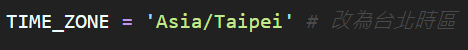

# Python_Django3
Programming_Exercise

## 確認是否有安裝套件

- > python --version
- > pip list
- > pip install numpy
- > pip install --upgrade numpy
- > pip install django
- > pip install --upgrade django

## 開始使用 Django

1. 創 project

- > django-admin startproject myproject

2. 創 App

- > python manage.py startapp myapp
- > md templetes
- > md static
- > python manage.py runserver

3. 成功畫面

## 在 myproject 裡面 settings.py 新增內容

### 1. settings.py 新增內容
#### INSTALLED_APPS

- > 'myapp', # 新增的 app

#### TEMPLATES 

- > 'DIRS': [BASE_DIR / 'templates'], # 加上 templates 路徑

#### LANGUAGE_CODE

- > LANGUAGE_CODE = 'zh-hant' # 改為繁體中文

#### TIME_ZONE

- > TIME_ZONE = 'Asia/Taipei' # 改為台北時區

#### 新增 STATICFILES_DIRS

- > STATICFILES_DIRS = [    # 加入 static 路徑
    BASE_DIR / 'static',
]

#### 以上完成 settings.py 的設定

## urls.py 檔案

#### urls.py 匯入 myapp.views 連結

- > from myapp.views import 函數名稱

#### 第二周作業內容 urls.py 檔

## views.py 檔案

#### views.py 匯入兩個套件

- > from django.http import HttpResponse
- > from datetime import datetime

#### 第二周作業內容 views.py 檔

## templates 寫入 html 檔

#### 以上完成第二周作業

#### 第三周作業內容 urls.py 檔

#### 第三周作業內容 views.py 檔

#### 第三周作業內容 templetes 檔

1. test.html

2. test1.html

#### 以上完成第三周作業